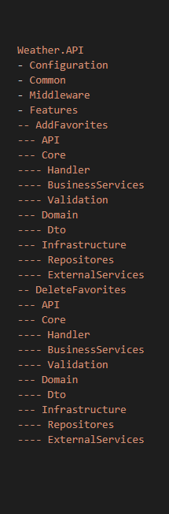
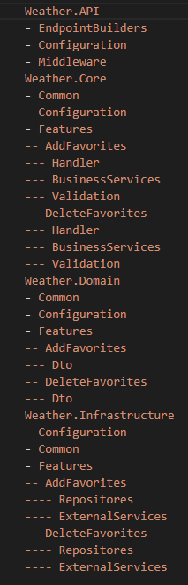

*Posted 11/15/2024*
# Comparsion of Vertical Slice Architecture and Clean Architecture

## Pull Request of new CRUD endpoint
Clean Architecture - [Pull Request](https://github.com/Gramli/WeatherApi/pull/2)

Vertical Slice Architecture (VSA) - [Pull Request](https://github.com/Gramli/WeatherApi-VSA/pull/1)

Both [Clean Architecture Weather Api (CA)](https://github.com/Gramli/WeatherApi) and [Vertical Slice Architecture Weather Api (VSA)](https://github.com/Gramli/WeatherApi-VSA) are just small APIs, but there is clearly one big difference. CA has almost twice more touched files, which could result in bugs. Therefore, it is crucial for CA to follow SOLID principles and have good code coverage.
In VSA, I add files to my new feature folder, except when editing other features due to the return type (which is the same as in CA). However, as a project grow, code duplication can become a significant issue. In case we find out code duplication, one way to resolve this issue is by moving the code to the domain. However, this can cause the domain to become excessively large.

Based on the PR comparison, we can also see that VSA is well-suited for tiny or CRUD APIs due to its simplicity and minimal use of abstractions. When we adhere to the same folder structure, it can result in a clean and clear solution.
### Unit Testing
In CA, unit testing is easy thanks to the high level of abstractions. However, as the project grows, it can result in a lot of repetitive work. Fortunately, with the support of AI, this issue can be alleviated. In VSA, it depends. When we look at this example, everything is within the handler (business logic, access to the database). Therefore, for growing project, this is not a good approach because writing and maintaining unit tests can become increasingly difficult even for the AI. But for this simple example, it fits well.

### Final Thoughts
In comparison, VSA resolves the issue of CA by touching all layers for just one feature. However, on the other hand, there is a risk of code duplication which CA reduces by splitting the code into layers and then into reusable services. Unit testing is easier and cleaner in CA, but it results in repetition. Unit testing in VSA could be difficult in cases when we put too much logic into one file. The solution for these issues can be to create a hybrid of both architectures.

## Hybrid Approaches

The first approach is to use VSA in the base with a feature folder structure and follow the rule that features do not reference each other. From CA, use a good level of abstractions in features where needed; we don't have to create abstractions in simple CRUD operations. The second approach could be to use CA as the base architecture and create a 'Feature' folder in every layer. Then, put feature-related logic for each layer into its respective 'Feature' folder and of course follow the rule that features do not reference each other.

<table>
  <thead>
    <tr>
      <th width="50%">Vertical Slice Architecture Hybrid First Approach </th>
      <th width="50%">Clean Architecture Hybrid First Approach</th>
    </tr>
  </thead>
  <tbody>
  <tr>
   <td>

</td>
   <td>

</td>
</tr>
<tr>
 <td>Shared folders like Common and Configuration could become quite large because they are shared between all features. However, we have the flexibility to create new features with a small or even no structure, using just a few files. Additionally, we only need to touch the feature folder, which reduces the risk of introducing bugs, although it may still result in some code duplication.</td>
 <td>The CA hybrid architecture structure is much larger, as it requires us to adhere to the structure in order to reduce the risk of code duplication and maintain a uniform structure. However, we have to touch all layers, even in the feature-related folder. Additionally, we are losing the ability to create small features without adhering to the structure.</td>
</tr>
  </tbody>
</table>

Both hybrid approaches reduce the risks and disadvantages, but do not completely resolve them. Therefore, **we still need to choose which architecture best suits our project**.

## Conclusion
VSA is still new to me, but I am enthusiastic about it and I believe it is the best fit for small projects. While I have a lot of experience with CA in small and medium-sized projects, I must say that it is a good fit and I have always been satisfied with it. However, it is important to emphasize the need for maintaining the structure, which involves following SOLID principles and patterns such as CQRS, Repository, DI, etc. By doing so, the project can be well-maintained.

And lastly, the most important sentence at the end: **the architecture of a project depends on the project's needs.**