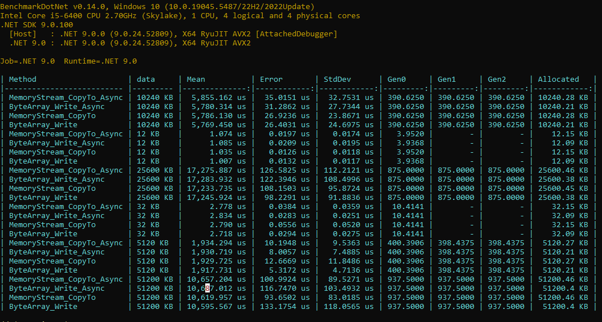

*Posted 03/06/2025*
# CopyTo vs Write

I wanted to write a byte array to a MemoryStream using the Write method, but Copilot kept trying to convince me — and I quote:

*CopyToAsync might offer better performance due to its internal optimizations for copying data between streams. The performance difference between these two approaches can be minimal for small to moderately sized data.*

According to Copilot, small to medium data means 12 KB to 32 KB, while large data refers to 5 MB to 10 MB.

I agree that for very large data, CopyTo or CopyToAsync might have some performance advantages. However, when we are talking about data sizes around 50 MB — or even more — the difference is negligible.

To prove my point, I created a benchmark:

.NET9  


## Code

```csharp
using BenchmarkDotNet.Attributes;
using BenchmarkDotNet.Jobs;

namespace GeneralBenchmark.CopyToAndWrite
{
    [SimpleJob(RuntimeMoniker.Net90)]
    [Orderer(BenchmarkDotNet.Order.SummaryOrderPolicy.Declared)]
    [MemoryDiagnoser]
    public class CopyToAndWriteBenchmark
    {
        public IEnumerable<CopyToAndWriteBenchmarkData> Data()
        {
            yield return new CopyToAndWriteBenchmarkData(1024 * 12);
            yield return new CopyToAndWriteBenchmarkData(1024 * 32);
            yield return new CopyToAndWriteBenchmarkData(1024 * 1024 * 5);
            yield return new CopyToAndWriteBenchmarkData(1024 * 1024 * 10);
            yield return new CopyToAndWriteBenchmarkData(1024 * 1024 * 25);
            yield return new CopyToAndWriteBenchmarkData(1024 * 1024 * 50);
        }


        [Benchmark]
        [ArgumentsSource(nameof(Data))]
        public async Task MemoryStream_CopyTo_Async(CopyToAndWriteBenchmarkData data)
        {
            using var outerStream = new MemoryStream();
            using var innerStream = new MemoryStream(data.ByteData);
            await innerStream.CopyToAsync(outerStream);

        }

        [Benchmark]
        [ArgumentsSource(nameof(Data))]
        public async Task ByteArray_Write_Async(CopyToAndWriteBenchmarkData data)
        {
            using var outerStream = new MemoryStream();
            await outerStream.WriteAsync(data.ByteData);
        }

        [Benchmark]
        [ArgumentsSource(nameof(Data))]
        public void MemoryStream_CopyTo(CopyToAndWriteBenchmarkData data)
        {
            using var outerStream = new MemoryStream();
            using var innerStream = new MemoryStream(data.ByteData);
            innerStream.CopyTo(outerStream);

        }

        [Benchmark]
        [ArgumentsSource(nameof(Data))]
        public void ByteArray_Write(CopyToAndWriteBenchmarkData data)
        {
            using var outerStream = new MemoryStream();
            outerStream.Write(data.ByteData);
        }
    }
}

```

[Link To Code](https://github.com/Gramli/ReflectionBenchmark/tree/feature/gramli-framework)

## Summary
The difference is in tens of microseconds. This doesn’t mean CopyTo is bad — it’s just not always better, especially for data sizes like this. The right choice depends on your scenario.
