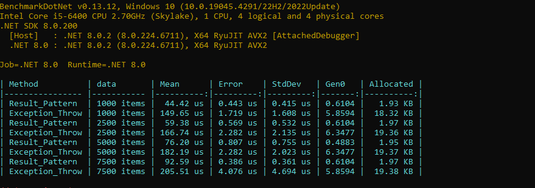

*Posted 11/15/2024*
# Throwing Exceptions vs Result Pattern
In the realm of error handling and control flow in C# programming, developers often encounter the choice between two primary approaches: Throwing Exceptions and employing the Result Pattern. The Throwing Exceptions method relies on the standard exception mechanism to handle error conditions, while the Result Pattern entails returning a structured result object containing both the result of the operation and any potential error information. This benchmark measure aims to compare the performance of these two approaches.

For the benchmark measure, I've created two handlers: [ResultHandler](#resulthandler) and [ThrowExceptionHandler](#throwexceptionhandler). Both perform the same task but with different error handling mechanisms.

## ResultHandler

```csharp
    internal class ThrowExceptionHandler(Logger logger)
    {
        private readonly Logger _logger = logger;

        public async Task<HandleDto?> Handle(IEnumerable<RequestItem> data)
        {
            if (data is null || !data.Any())
            {
                return default;
            }

            try
            {
                var processResult = await ProcessData(data);
                return new HandleDto { Sum = processResult };
            }
            catch(Exception ex)
            {
                _logger.Log(ex);
                return default;
            }
        }

        private async Task<double> ProcessData(IEnumerable<RequestItem> data)
        {
            var getValidDataResult = await GetValidData(data);

            var positiveDataResult = await GetPositiveData(getValidDataResult);

            return positiveDataResult.Sum(x => x.Value);
        }

        private async Task<IEnumerable<RequestItem>> GetValidData(IEnumerable<RequestItem> inputData)
        {
            if (inputData.All(x => !x.IsValid))
            {
                throw new ArgumentException("All data are invalid", nameof(inputData));
            }

            await Task.Yield();
            return inputData.Where(x => x.IsValid);
        }

        private async Task<IEnumerable<RequestItem>> GetPositiveData(IEnumerable<RequestItem> inputData)
        {
            if (inputData.All(x => x.Value < 0))
            {
                throw new ArgumentException("All data are smaller than 0", nameof(inputData));
            }

            await Task.Yield();
            return inputData.Where(x => x.Value > 0);
        }
    }
```

## ThrowExceptionHandler

```csharp
internal class ThrowExceptionHandler(Logger logger)
    {
        private readonly Logger _logger = logger;

        public async Task<HandleDto?> Handle(IEnumerable<RequestItem> data)
        {
            if (data is null || !data.Any())
            {
                return default;
            }

            try
            {
                var processResult = await ProcessData(data);
                return new HandleDto { Sum = processResult };
            }
            catch(Exception ex)
            {
                _logger.Log(ex);
                return default;
            }
        }

        private async Task<double> ProcessData(IEnumerable<RequestItem> data)
        {
            var getValidDataResult = await GetValidData(data);

            var positiveDataResult = await GetPositiveData(getValidDataResult);

            return positiveDataResult.Sum(x => x.Value);
        }

        private async Task<IEnumerable<RequestItem>> GetValidData(IEnumerable<RequestItem> inputData)
        {
            if (inputData.All(x => !x.IsValid))
            {
                throw new ArgumentException("All data are invalid", nameof(inputData));
            }

            await Task.Yield();
            return inputData.Where(x => x.IsValid);
        }

        private async Task<IEnumerable<RequestItem>> GetPositiveData(IEnumerable<RequestItem> inputData)
        {
            if (inputData.All(x => x.Value < 0))
            {
                throw new ArgumentException("All data are smaller than 0", nameof(inputData));
            }

            await Task.Yield();
            return inputData.Where(x => x.Value > 0);
        }
    }
```



## Summary
When examining the code, it's evident that the implementation with exception throwing appears much simpler and cleaner. However, I've observed numerous instances where exception throwing led to a cycle of catch and rethrow, resulting in spaghetti code. From the benchmark measure, it's apparent that this approach is also two or three times slower and allocates significantly more memory.