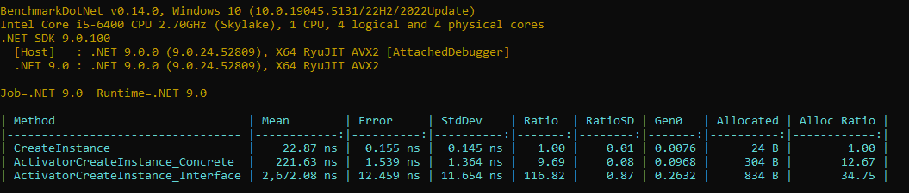

*Posted 11/15/2024*
## Create Instance of Class

### [Source Solution](https://github.com/Gramli/ReflectionBenchmark/tree/main/src/ReflectionBenchmark/CreateClassInstance)

Even if we use IoC container which holds instance of our class, sometimes we need to create new instance of the class, typically with different parameters dedicated for specific scope. In that case we can use reflection.

Benchmark show results of three methods:
* CreateInstance - create instance using already builded ServiceProvider (fastest and preferable solution)
* ActivatorCreateInstance_Interface - create instance of class by interface. We need to find interace implementation so we use GetTypeByInterfaceSingle extension method which search through assembly types
* ActivatorCreateInstance_Concrete - create instance of class by class type.

* .NET8
  

.NET9  
*   

#### Summary
The Activator.CreateInstance_Concrete method proves to be sufficiently fast when compared to CreateInstance, but it requires specifying a concrete class. On the other hand, Activator.CreateInstance_Interface is much slower than Activator.CreateInstance_Concrete, yet it offers the advantage of being generic. This means it doesn't necessitate editing the method each time we change the implementation of an interface.

Creating instances via the ServiceProvider is consistently the preferred and cleanest solution, as it's initiated at a defined starting point of the application or request. However, in specific cases where instance creation is required at runtime, the choice between Activator.CreateInstance_Concrete and Activator.CreateInstance_Interface depends on various factors, each with its own set of advantages and drawbacks.