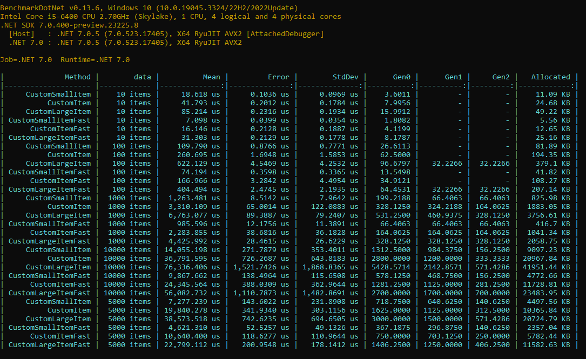

*Posted 11/15/2024*
## Export Data by Reflection

### [Source Solution](https://github.com/Gramli/ReflectionBenchmark/tree/main/src/ReflectionBenchmark/GenericExport)

Exporting data to .csv, .xlsx, and .ods file formats is standard in many business applications. In this scenario, we utilize reflection within a generic export method, leveraging custom attributes that represent headers.

Benchmar show results of three classes with different sizes which are exported to csv file.
* **CustomLargeItem** with 32 properties 
* **CustomItem** with 16 properties
* **CustomSmallItem** with 7 properties

Implementation of our generic csv export is in GenericCsvExport.GenericCsvExport extension method. To be able to compare the generic export I created extension methods for every class which has headers prepared in collection (CsvItemExport, CvLargeItemExport, CsvSmallItemExport).

.NET8  
  
.NET9  
  

#### Summary
The results indicate that the faster method performs nearly twice as fast and allocates almost half the memory. However, it's crucial to note that the execution time is measured in microseconds. Despite the apparent speed advantage of the faster method, reflection still stands out as the superior solution.

Reflection offers the advantage of dynamic and flexible behavior, making it more adaptable to changes and future enhancements. While the performance difference might seem significant in microsecond terms, the broader considerations of code maintainability and scalability often favor the versatility of reflection. Therefore, despite its slower performance in this specific benchmark, reflection remains the preferred choice for its long-term benefits.